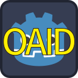

# Godot OAID SDK
[](https://godotengine.org/asset-library/asset/3784)

Godot 安卓导出插件，用于接入 [Android_CN_OAID](https://github.com/gzu-liyujiang/Android_CN_OAID) 并提供包装类。

本插件使用了 Godot 4.4 修复后的 JavaClassWrapper 以及新增的对 Android 运行时的访问功能。

## 用法
启用插件后，修改安卓导出预设的 oaid/version 选项，指定 Android_CN_OAID SDK 版本，并启用 Gradle 构建。

```GDScript
# （可选）初始化
device_identifier.register()

# 使用该方法获取客户端唯一标识，需要先调用 register() 预取。
device_identifier.get_client_id()

# 获取唯一设备标识。Android 6.0-9.0 需要申请电话权限才能获取 IMEI/MEID，Android 10+ 非系统应用则不再允许获取 IMEI。
device_identifier.get_imei()

# 用该方法获取OAID/AAID，需要先调用 register() 预取。
device_identifier.get_oaid()

# 获取AndroidID。
device_identifier.get_android_id()

# 获取数字版权管理设备ID。
device_identifier.get_widevine_id()

# 通过取出ROM版本、制造商、CPU型号以及其他硬件信息来伪造设备标识。
device_identifier.get_pseudo_id()

# 随机生成全局唯一标识并存到 SharedPreferences、ExternalStorage 及 SystemSettings。
device_identifier.get_guid()
```
